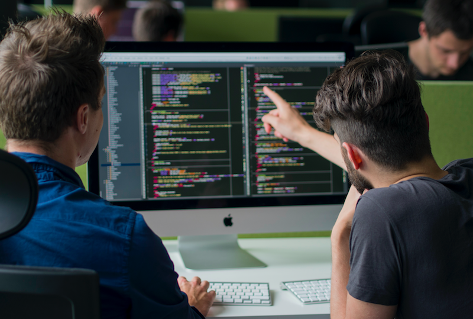

# Titre

## Cartouche d'identification

 - Manifestation : CodeursEnSeine 2018
 - Lieu : KindArena - Rouen
 - Conférence : La programmation en binôme, c’est magique !
 - Horaire de la conférence : 14h30 - 15h20
 - Durée de la conférence : 50 minutes
 - Conférencier : 
   - Frédéric Leguédois (Site personnel : http://www.leguedois.fr/, Twitter : https://twitter.com/f_leguedois?lang=fr, LinkedIn : https://www.linkedin.com/in/fr%C3%A9d%C3%A9ric-legu%C3%A9dois/?originalSubdomain=fr)
 - Audience : environ 100 personnes
 - Auteur du billet : Denis Coquenet
 - Mots-clés : Binôme - Pair programming - Efficience - Apprentissage - Performancce
 - URL de l'illustration : 
   - source : https://hackernoon.com/learning-how-to-code-using-pair-programming-at-microverse-562d5d49f2f1

## Support
 - Lien vers le support (diapos) présenté en conférence : le support n'est pas disponible en ligne ; de plus, la conférence n'est pas filmée. (cf http://www.leguedois.fr/pourquoi-les-conferences-ne-sont-pas-filmees/)
 - Nombre de diapos du support : 2
 - Plan du support : pas de plan déterminé (seulement une slide d'introduction et une slide avec un tableau comparatif).

## Résumé
...

## Architecture et facteur qualité
...
